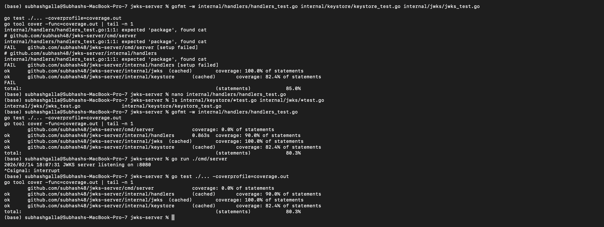
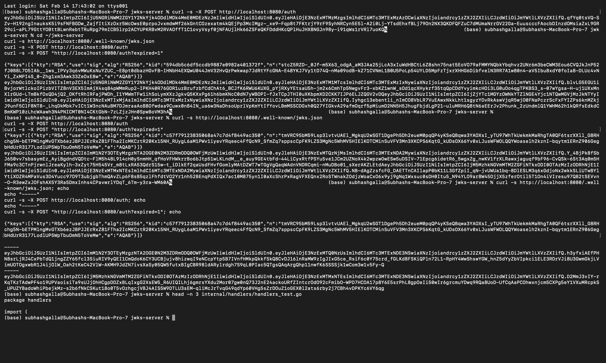
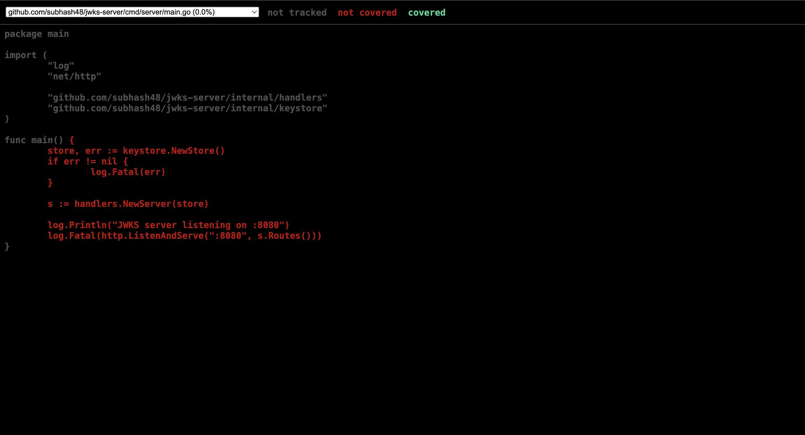
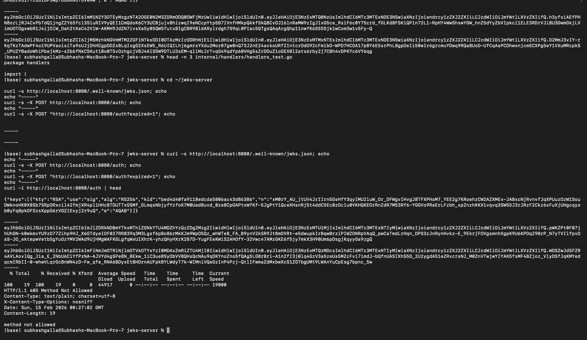

# JWKS Server (Go)

A simple JWKS + JWT auth server.

## Endpoints

### GET /.well-known/jwks.json
Returns a JWKS containing **only the active (unexpired) RSA public key**.

### POST /auth
Returns a **valid RS256 JWT** signed with the active private key.
Header includes `kid` matching the JWKS key.

### POST /auth?expired=1
Returns an **expired JWT** signed with the expired private key.
This JWT is still correctly signed, but the `exp` claim is in the past.

### GET /auth
Returns **405 Method Not Allowed**

## Run locally

```bash
go run ./cmd/server

## Screenshots

### JWKS endpoint (active key only)


### /auth (valid JWT)


### Test coverage


### GET /auth returns 405


